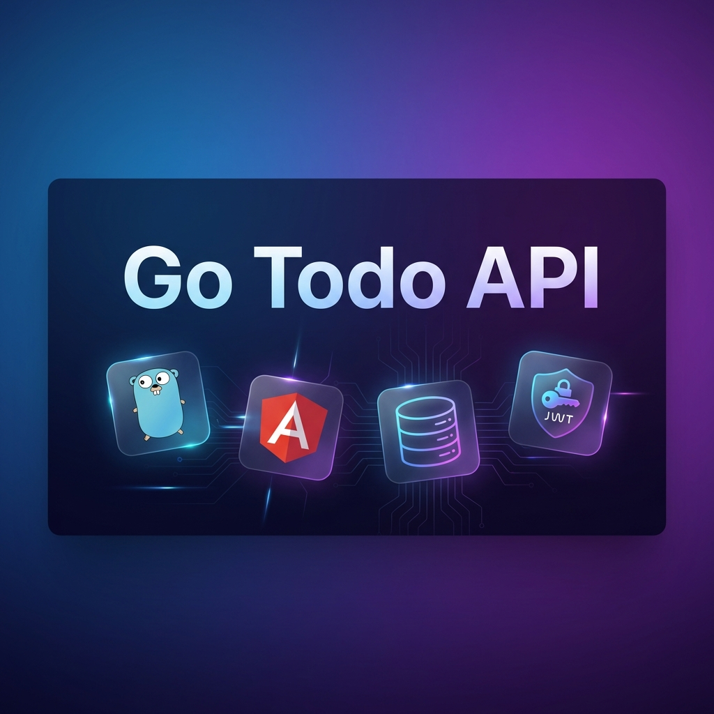
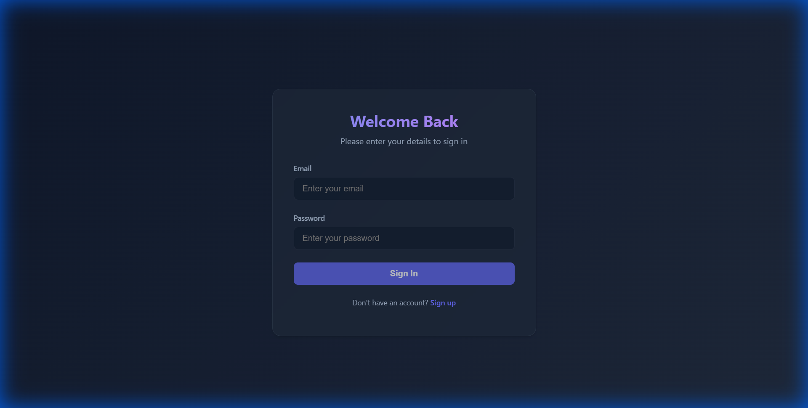
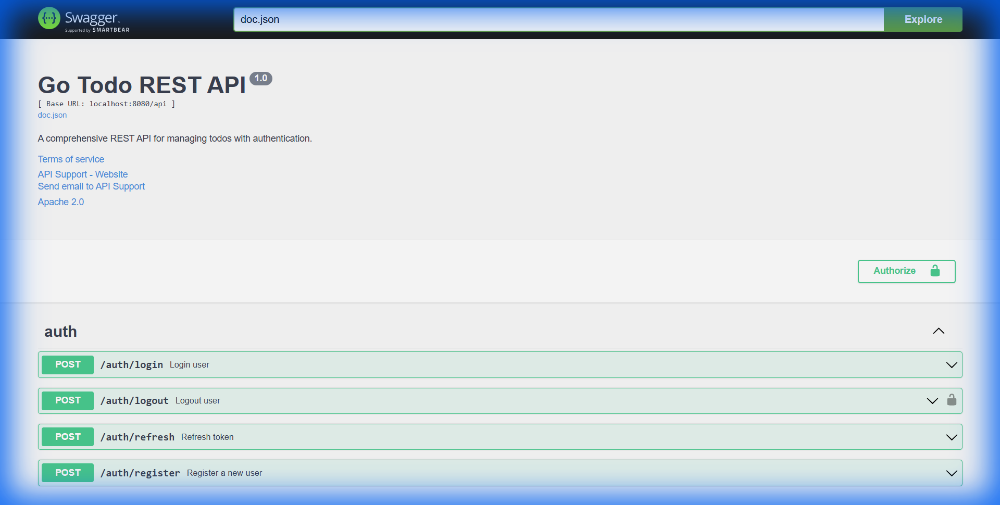
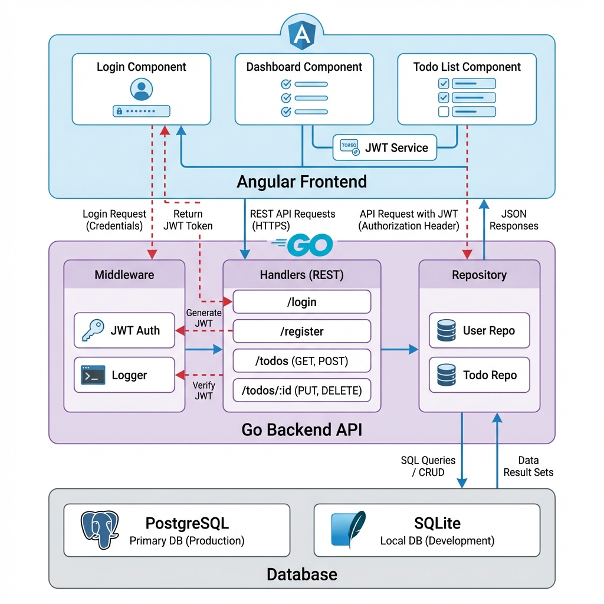

# Go Todo REST API

<div align="center">



[](https://golang.org/)
[](https://angular.io/)
[](LICENSE)
[](http://makeapullrequest.com)

**A production-ready full-stack todo application showcasing modern backend development with Go**

[Features](#-features) • [Tech Stack](#️-tech-stack) • [Quick Start](#-quick-start) • [API Docs](#-api-documentation) • [Architecture](#-architecture)

</div>

---

## 📸 Application Preview

<table>
<tr>
<td width="50%">

### Login Interface

Modern, dark-themed authentication interface with secure JWT-based login

</td>
<td width="50%">

### Interactive API Documentation

Comprehensive Swagger/OpenAPI documentation for all endpoints

</td>
</tr>
</table>

## 🎯 Why This Project?

This project demonstrates **industry-grade software engineering practices** for a full-stack application. It's more than just a todo app - it's a showcase of:

- ✅ **Clean Architecture** with clear separation of concerns
- ✅ **Production-Ready Features** like JWT authentication, middleware, and monitoring
- ✅ **Modern Full-Stack Development** with Go backend and Angular frontend
- ✅ **DevOps Best Practices** with Docker, CI/CD ready, and comprehensive documentation
- ✅ **API-First Design** with Swagger/OpenAPI documentation

Perfect for demonstrating technical skills in **fresher SDE roles** and **backend engineering positions**.

## 🚀 Features

### Core Functionality
| Feature | Description | Technology |
|---------|-------------|------------|
| 🔐 **User Authentication** | Secure JWT-based registration and login with bcrypt password hashing | `golang-jwt/jwt`, `bcrypt` |
| ✅ **Todo CRUD Operations** | Complete create, read, update, delete operations with advanced filtering | `GORM`, `Gin` |
| 🛡️ **Protected Routes** | Middleware-based authentication and authorization | Custom middleware |
| 🗄️ **Database Flexibility** | SQLite for development, PostgreSQL for production | `GORM ORM` |
| 📦 **Docker Ready** | Fully containerized with Docker Compose support | `Docker`, `docker-compose` |

### Advanced Features
| Feature | Description |
|---------|-------------|
| 📚 **Swagger UI** | Interactive API documentation at `/swagger/index.html` |
| 📊 **Prometheus Metrics** | Application monitoring and metrics at `/metrics` |
| 🔄 **Token Refresh** | Automatic token refresh mechanism with separate refresh tokens |
| ⚡ **High Performance** | Built with Gin framework for maximum throughput |
| 🎨 **Modern Angular Frontend** | Responsive, dark-themed UI with TypeScript |
| 🔍 **Advanced Filtering** | Pagination, search, sorting, and status filtering |
| ✅ **Comprehensive Testing** | Unit and integration tests included |

## 🛠️ Tech Stack

### Backend
```
┌─────────────────────────────────────────────────┐
│  Go 1.21+ (Core Language)                       │
│  ├── Gin (HTTP Framework)                       │
│  ├── GORM (ORM)                                 │
│  ├── JWT (Authentication)                       │
│  ├── Swagger/OpenAPI (Documentation)            │
│  ├── Prometheus (Monitoring)                    │
│  └── bcrypt (Password Security)                 │
└─────────────────────────────────────────────────┘
```

### Frontend
```
┌─────────────────────────────────────────────────┐
│  Angular 21 (Framework)                         │
│  ├── TypeScript 5.9                             │
│  ├── RxJS (Reactive Programming)                │
│  ├── Angular Router (Navigation)                │
│  └── Modern CSS (Dark Mode UI)                  │
└─────────────────────────────────────────────────┘
```

### Database & Infrastructure
```
┌─────────────────────────────────────────────────┐
│  SQLite (Development)                           │
│  PostgreSQL (Production)                        │
│  Docker & Docker Compose                        │
└─────────────────────────────────────────────────┘
```

## 📁 Project Structure

```
go-todo-api/
├── cmd/api/                 # Application entry point
│   └── main.go              # Server initialization
├── internal/                # Private application code
│   ├── config/              # Environment configuration
│   ├── database/            # Database connection & migrations
│   ├── handlers/            # HTTP request handlers (controllers)
│   ├── middleware/          # Auth, CORS, logging middleware
│   ├── models/              # Data models & DTOs
│   ├── repository/          # Data access layer (Repository pattern)
│   └── routes/              # Route definitions & grouping
├── pkg/utils/               # Shared utilities (JWT, password, responses)
├── tests/                   # Integration & unit tests
├── docs/                    # Swagger/OpenAPI generated docs
├── web/                     # Angular frontend application
│   ├── src/app/             # Angular components & services
│   └── public/              # Static assets
├── assets/                  # Documentation images & screenshots
├── docker-compose.yml       # Multi-container orchestration
├── Dockerfile               # Backend container build
└── .env.example             # Environment variables template
```

## 🏃 Quick Start

### Prerequisites
- **Go** 1.21 or higher ([Download](https://golang.org/dl/))
- **Node.js** 18+ and npm ([Download](https://nodejs.org/))
- **Git**

### Local Development (Zero Docker Setup)

#### 1️⃣ Clone the Repository
```bash
git clone https://github.com/Aisenh037/To-Do-App.git
cd To-Do-App
```

#### 2️⃣ Start Backend
```bash
# Install dependencies
go mod download

# Run the server (uses SQLite automatically)
go run ./cmd/api
```

✅ **Backend running at** `http://localhost:8080`

#### 3️⃣ Start Frontend (New Terminal)
```bash
# Navigate to web directory
cd web

# Install dependencies
npm install

# Start development server
npm start
```

✅ **Frontend running at** `http://localhost:4200`

#### 4️⃣ Access the Application
| Service | URL | Description |
|---------|-----|-------------|
| 🎨 **Frontend** | http://localhost:4200 | Angular web application |
| 📚 **Swagger UI** | http://localhost:8080/swagger/index.html | Interactive API docs |
| 💚 **Health Check** | http://localhost:8080/api/health | API health status |
| 📊 **Metrics** | http://localhost:8080/metrics | Prometheus metrics |

## 🏗️ Architecture



The application follows a **layered architecture** with clear separation of concerns:

### Architectural Layers
1. **Presentation Layer** (Angular) - User interface and client-side logic
2. **Application Layer** (Go Handlers) - Request processing and business logic
3. **Domain Layer** (Repository Pattern) - Data access abstraction
4. **Infrastructure Layer** (Database) - Data persistence

### Design Patterns
- **Repository Pattern** - Abstracts database operations
- **Middleware Pattern** - Cross-cutting concerns (auth, logging, CORS)
- **DTO Pattern** - Separates API contracts from internal models

📖 **[Read Full Architecture Documentation →](./ARCHITECTURE.md)**

## 📡 API Documentation

### Authentication (Public Routes)

<details>
<summary><b>POST</b> /api/auth/register - Register new user</summary>

**Request Body:**
```json
{
  "email": "user@example.com",
  "password": "securePassword123",
  "name": "John Doe"
}
```

**Response:**
```json
{
  "status": "success",
  "data": {
    "access_token": "eyJhbGciOiJIUzI1NiIs...",
    "refresh_token": "eyJhbGciOiJIUzI1NiIs...",
    "user": {
      "id": 1,
      "email": "user@example.com",
      "name": "John Doe"
    }
  }
}
```
</details>

<details>
<summary><b>POST</b> /api/auth/login - User login</summary>

**Request Body:**
```json
{
  "email": "user@example.com",
  "password": "securePassword123"
}
```

**Response:** Same as registration
</details>

<details>
<summary><b>POST</b> /api/auth/refresh - Refresh access token</summary>

**Headers:** `Authorization: Bearer {refresh_token}`

**Response:**
```json
{
  "status": "success",
  "data": {
    "access_token": "eyJhbGciOiJIUzI1NiIs..."
  }
}
```
</details>

### Todos (Protected Routes - Requires JWT)

<details>
<summary><b>GET</b> /api/todos - Get todos with advanced filtering</summary>

**Headers:** `Authorization: Bearer {access_token}`

**Query Parameters:**
- `page` - Page number (default: 1)
- `page_size` - Items per page (default: 10, max: 100)
- `status` - Filter: `pending`, `in_progress`, `completed`
- `search` - Search in title/description
- `sort_by` - `created_at`, `title`, `status`, `due_date`
- `sort_dir` - `ASC` or `DESC`

**Example Request:**
```bash
GET /api/todos?page=1&page_size=10&status=pending&sort_by=created_at&sort_dir=DESC
```

**Response:**
```json
{
  "status": "success",
  "data": {
    "todos": [...],
    "pagination": {
      "page": 1,
      "page_size": 10,
      "total": 45,
      "total_pages": 5
    }
  }
}
```
</details>

<details>
<summary><b>POST</b> /api/todos - Create new todo</summary>

**Headers:** `Authorization: Bearer {access_token}`

**Request Body:**
```json
{
  "title": "Complete project documentation",
  "description": "Write comprehensive README and architecture docs",
  "status": "in_progress",
  "due_date": "2026-01-20T23:59:59Z"
}
```
</details>

<details>
<summary><b>PUT</b> /api/todos/:id - Update todo</summary>

**Headers:** `Authorization: Bearer {access_token}`

**Request Body:** Same as create (all fields optional)
</details>

<details>
<summary><b>DELETE</b> /api/todos/:id - Delete todo</summary>

**Headers:** `Authorization: Bearer {access_token}`
</details>

### User Profile

<details>
<summary><b>GET</b> /api/profile - Get current user profile</summary>

**Headers:** `Authorization: Bearer {access_token}`
</details>

<details>
<summary><b>POST</b> /api/auth/logout - Logout and revoke tokens</summary>

**Headers:** `Authorization: Bearer {access_token}`
</details>

🔗 **[Explore Full API in Swagger UI →](http://localhost:8080/swagger/index.html)** (after starting the server)

## 🐳 Docker Deployment

### Using Docker Compose

```bash
# Start all services (backend + PostgreSQL)
docker-compose up -d

# View logs
docker-compose logs -f

# Stop services
docker-compose down
```

📖 **[Full Deployment Guide →](./DEPLOYMENT.md)** (includes Railway, Render, AWS, DigitalOcean)

## 🧪 Running Tests

```bash
# Run all tests
go test ./...

# Run with verbose output
go test -v ./...

# Run integration tests
go test -v ./tests/...

# Run specific package tests
go test ./pkg/utils/...

# Run with coverage
go test -cover ./...
```

## 📚 What I Learned

Building this project taught me:

### Backend Development
- ✅ **RESTful API Design** - Designing clean, intuitive API endpoints
- ✅ **Authentication & Security** - JWT tokens, bcrypt hashing, secure middleware
- ✅ **Database Design** - Schema design, indexing, ORM usage
- ✅ **Go Best Practices** - Project structure, error handling, dependency management
- ✅ **Middleware Implementation** - CORS, authentication, logging
- ✅ **API Documentation** - Swagger/OpenAPI specification

### Full-Stack Integration
- ✅ **Frontend-Backend Communication** - HTTP clients, token management
- ✅ **CORS Configuration** - Cross-origin resource sharing
- ✅ **State Management** - JWT token persistence and refresh logic

### DevOps & Deployment
- ✅ **Containerization** - Docker, multi-stage builds, docker-compose
- ✅ **Environment Configuration** - `.env` files, config management
- ✅ **Monitoring** - Prometheus metrics, health checks

### Software Engineering
- ✅ **Design Patterns** - Repository, Middleware, DTO patterns
- ✅ **Testing** - Unit tests, integration tests, test-driven development
- ✅ **Documentation** - Code comments, API docs, architecture documentation

## 🔮 Future Enhancements

Ideas for extending this project:

- [ ] **Redis Caching** - Cache frequently accessed todos
- [ ] **Email Notifications** - Send reminders for due dates
- [ ] **Role-Based Access Control** - Admin/user roles
- [ ] **File Attachments** - Attach files to todos
- [ ] **Real-time Updates** - WebSocket support for live updates
- [ ] **Mobile App** - React Native or Flutter client
- [ ] **CI/CD Pipeline** - GitHub Actions for automated testing and deployment
- [ ] **Rate Limiting** - API rate limiting middleware
- [ ] **Multi-tenancy** - Support for teams/organizations
- [ ] **GraphQL API** - Alternative to REST endpoints

## 🤝 Contributing

Contributions are welcome! This is a learning project, and I'm open to suggestions and improvements.

1. Fork the repository
2. Create a feature branch (`git checkout -b feature/amazing-feature`)
3. Commit your changes (`git commit -m 'Add amazing feature'`)
4. Push to the branch (`git push origin feature/amazing-feature`)
5. Open a Pull Request

## 📄 License

This project is licensed under the MIT License - feel free to use it for learning and portfolio purposes!

---

<div align="center">

**Built with ❤️ using Go and Angular**

If you found this project helpful, please consider giving it a ⭐!

[Report Bug](https://github.com/Aisenh037/To-Do-App/issues) • [Request Feature](https://github.com/Aisenh037/To-Do-App/issues)

</div>
